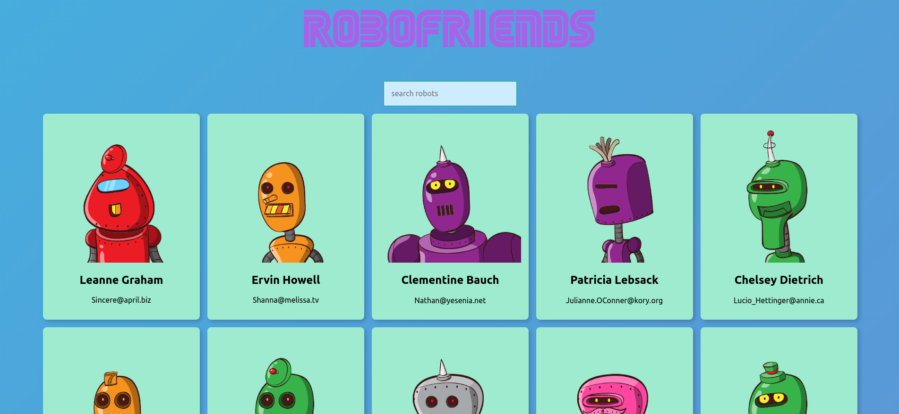

# ROBOFRIENDS, My first react project! :robot:

<h2>Overview</h2>

It is a very basic project where you can find a robofriend. 
You can find a robot using a searchbar, their profile pictures are randomly generated using robohash. 
you can either fork/clone this repo or visit https://4upakabra13.github.io/robofriends/

